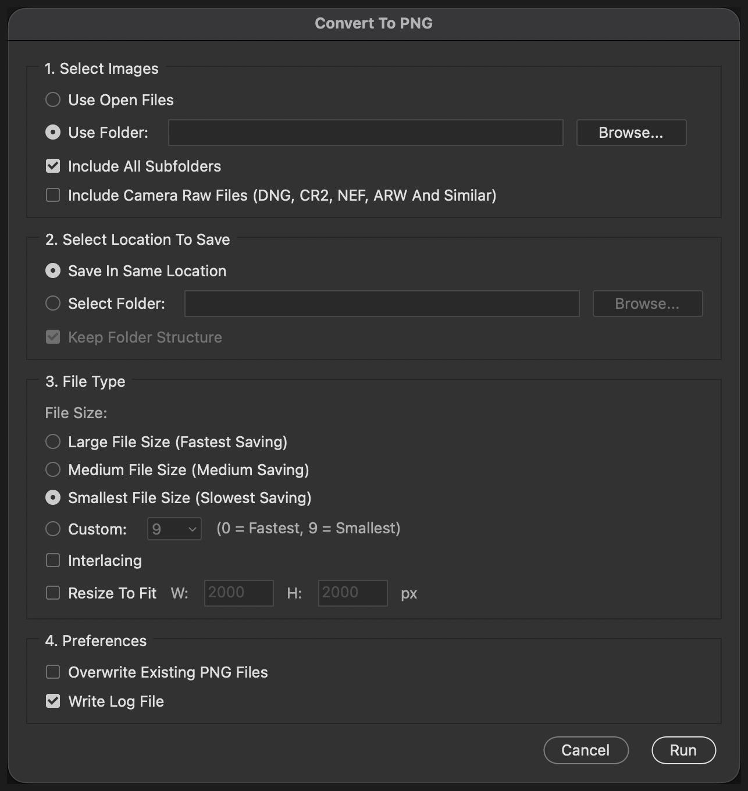

# Multilat PNG Processor — Batch PNG Export for Adobe Photoshop

A free Photoshop script that batch converts PSD, TIFF, JPEG and other
images to PNG, preserving the source folder structure.

Adobe's own **Image Processor** only outputs JPEG, PSD and TIFF. There is
no built-in way to batch export PNG from Photoshop. This fills that gap
with the same familiar dialog.



- **Version:** 1.5
- **Type:** ExtendScript (`.jsx`) — no plugin install, no build step
- **Platforms:** Windows and macOS
- **Photoshop:** CC 2018 or newer recommended
  ([CS6 caveat](https://github.com/multilat/multilat-png-processor/issues/1))
- **Licence:** MIT

## Features

- **Batch convert to PNG** from a folder or from the open documents
- **Preserves folder structure**, including when converting open files
- **Photoshop's real PNG methods** — Fastest, Medium and Smallest, set
  correctly rather than inherited
- **Recursive**, with optional Camera Raw support
- **Resize to fit** on export, never upscaling
- **Log file** recording settings, per-file timing, output size, and
  every skip or failure by name
- **Non-destructive** — sources are never modified
- **Stop mid-run** by holding Esc

## Install

Download the repository, then run the installer for your platform.

### Windows

Right-click `Install-Script.bat` and choose **Run as administrator**.
If you double-click it instead, it requests elevation itself.

### macOS

Double-click `Install-Script.command`. It asks for an administrator
password. If macOS blocks it as an unidentified developer, right-click
the file and choose **Open**, then confirm.

### Both Platforms

Administrator rights are needed because Photoshop's `Presets/Scripts`
folder is protected on both systems.

Afterwards, **quit Photoshop completely and reopen it** — the Scripts
menu is only read at launch.

The script then appears under **File > Scripts > Multilat-PNG-Processor**.

### Manual Install

Copy `Multilat-PNG-Processor.jsx` into the Photoshop application's
`Presets/Scripts` folder.

**Windows:**

```text
C:\Program Files\Adobe\Adobe Photoshop 2026\Presets\Scripts\
```

**macOS:**

```text
/Applications/Adobe Photoshop 2026/Presets/Scripts/
```

Do **not** use the user-level folder. On macOS,
`~/Library/Application Support/Adobe/.../Presets/Scripts` is never
scanned for scripts, unlike other preset types.

## Usage

Open **File > Scripts > Multilat-PNG-Processor**.

### 1. Select Images

**Use Open Files** converts every document currently open in Photoshop.

**Use Folder** converts a folder on disk. *Include All Subfolders* walks
the whole tree. *Include Camera Raw Files* adds DNG, CR2, NEF, ARW and
similar; leave it off unless you need it, because raw files open through
the Camera Raw engine and are much slower.

Accepted input: PSD, PSB, TIFF, JPEG, PNG, GIF, BMP, TGA, WebP, HEIC,
JP2, EXR, HDR and others.

### 2. Select Location To Save

**Save In Same Location** writes each PNG beside its source.

**Select Folder** writes into one folder. With *Keep Folder Structure*
the source tree is recreated inside it.

### 3. File Type

The three named levels are Photoshop's own PNG methods, identical to its
Save As dialog. **Custom** exposes compression 0 to 9 directly.

PNG is lossless, so this only trades saving time against file size.
**Large File Size (Fastest Saving) is the sensible default** for most
work.

*Interlacing* produces a progressively-loading file, slightly larger.
*Resize To Fit* scales output to fit the given box, never upscaling.

### 4. Preferences

*Overwrite Existing PNG Files* replaces output already on disk; left off,
those files are skipped and listed in the log. *Write Log File* records
what happened.

### While It Runs

A progress window shows position and filename. **Hold Esc** to stop after
the current file; it never interrupts a write mid-file.

### A Worked Example

To convert a tree of PSDs to PNGs beside each original:

1. **Use Folder**, browse to the top folder, tick *Include All Subfolders*
2. **Save In Same Location**
3. **Large File Size (Fastest Saving)**
4. Run, then check `PNG_Export_Log.txt` for `Failed: 0`

## Log File

`PNG_Export_Log.txt` is written into the destination folder, recording
settings, per-file save time and output size, and every skip or failure
by name.

```text
PNG Export Log
Source: /Volumes/Work/Shoot/PSD
Destination: /Volumes/Work/Shoot/PNG
Structure Measured From: /Volumes/Work/Shoot/PSD
PNG Method: quick (Compression 1)
Total Save Time: 5.6 s  (Average 467 ms Per File)
Total Output: 12.2 MB  (Average 1044 KB Per File)
Files Found: 12
Converted: 12
Skipped: 0
Failed: 0
```

## How It Works

These are the Photoshop behaviours the script works around. They cost
real time to discover, so they are documented here in full.

### PNG Method, Not Just Compression

ExtendScript's `PNGSaveOptions` has no `method` property, so
`doc.saveAs()` never tells Photoshop which PNG method to use. Photoshop
inherits whatever was last chosen in its own PNG Format Options dialog.
And `compression` is only honoured when that method is `quick`.

The practical effect is a save whose speed and file size depend on a
dialog the script never touched, and which differs between machines.

This script saves through the Action Manager instead, setting the method
explicitly:

| Dialog Choice                       | PNG Method |
| ----------------------------------- | ---------- |
| Large File Size (Fastest Saving)    | `quick`    |
| Medium File Size (Medium Saving)    | `moderate` |
| Smallest File Size (Slowest Saving) | `thorough` |

All three are verified working on Photoshop 2026, measured over the same
12 files:

| Method     | Total time | Per file | Total output | Per file |
| ---------- | ---------- | -------- | ------------ | -------- |
| `quick`    | 5.6 s      | 467 ms   | 12.2 MB      | 1044 KB  |
| `moderate` | 8.0 s      | 664 ms   | 11.6 MB      | 992 KB   |
| `thorough` | 16.3 s     | 1360 ms  | 11.0 MB      | 936 KB   |

`thorough` takes roughly three times as long as `quick` for about 10 per
cent less data. The ordering holds on every individual file, so the three
methods are genuinely distinct rather than aliases.

Compression **0 means stored** — no compression at all. It produces
larger files that are slower to write. Use 1 for speed, not 0.

### Saving The Right Document

Photoshop routes `saveAs` through the *active* document, not the one the
method is called on. Saving a non-active document writes the front
document's pixels into the target file — a data-loss bug reported since
CC 19.0.1. Every save here activates its document first.

### Keep Folder Structure

With a chosen source folder, structure is measured from that folder.

With open documents there is no chosen folder, so the deepest folder the
documents share is used instead. Open three files from `Shoot/PSD/01/…`,
`Shoot/PSD/02/…` and `Shoot/PSD/03/…` and the tree is recreated from
`Shoot/PSD` down.

Documents never saved to disk have no path and are left out of that
calculation. If the open files share no common folder — spread across
unrelated places, or across two volumes — the script says so and asks
before saving everything flat.

### Colour Profiles

Photoshop does not embed an ICC profile in a PNG, from a script or by
hand — a manual Save a Copy produces no `iCCP` chunk either. Output
carries XMP metadata only.

There is therefore no option for it. The script checks every written file
for an `iCCP` chunk and reports what it finds, so if a future Photoshop
gains the ability the log will say so.

Untagged PNG is read as sRGB everywhere, so sRGB sources come out
correct.

### Stopping A Run

There is deliberately no Stop button. A ScriptUI palette only receives
clicks while the script yields, and the conversion loop holds the thread
throughout, so a button would be clickable for only a few milliseconds
between files.

Esc is polled at the top of every iteration and works reliably. Hold it
rather than tapping it, because the check reads the key held at that
instant.

## Contributing

Issues and pull requests are welcome.

Two conventions matter for this file:

- **Keep the `.jsx` pure ASCII.** A `.jsx` without a byte-order mark is
  read using the system encoding, and a single non-ASCII character — an
  em dash in a comment is enough — stops the script parsing with no error
  message.
- **`.bat` files must keep CRLF line endings** or Windows may mis-parse
  them. `.gitattributes` pins this.

## Maintenance

A Photoshop major-version upgrade replaces the application folder and
takes the `Presets/Scripts` contents with it. Re-run the installer after
upgrading.

## Licence

MIT — see [LICENSE](LICENSE). Provided as-is, without warranty.

Not affiliated with or endorsed by Adobe. Photoshop is a trademark of
Adobe Inc.
